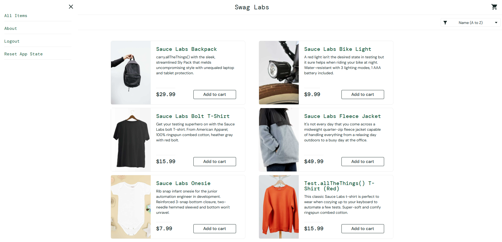

# TC-001 – Valid Login

## Objective

Verify that a valid user can successfully log in to the application.

## Preconditions

- User is on the SauceDemo login page.
- User has valid login credentials.

## Test Data

- Username: standard_user
- Password: secret_sauce

## Test Steps

1. Open the SauceDemo login page.
2. Enter a valid username.
3. Enter a valid password.
4. Click the Login button.

## Expected Result

The user should be successfully logged in and redirected to the products page.

## Actual Result

The user was successfully logged in and redirected to the products page.

## Status

Pass

## Notes

Login worked as expected.

## Evidence

