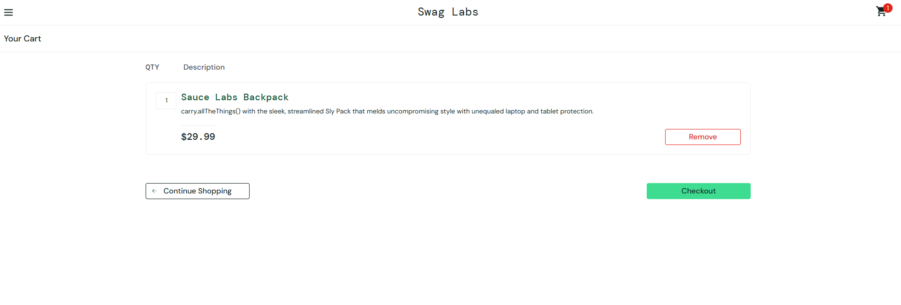

# TC-004 – Add Product to Cart

## Objective

Verify that a user can add a product to the shopping cart.

## Preconditions

- User is logged in.
- User is on the Products page.

## Test Data

- Username: standard_user
- Password: secret_sauce
- Product: Sauce Labs Backpack

## Test Steps

1. Log in with valid credentials.
2. Locate the Sauce Labs Backpack product.
3. Click the Add to Cart button.
4. Click the shopping cart icon.

## Expected Result

The selected product should be added to the cart and displayed on the Cart page.

## Actual Result

The selected product was added to the cart and displayed on the Cart page.

## Status

Pass

## Notes

The Add to Cart functionality worked as expected.

## Evidence

