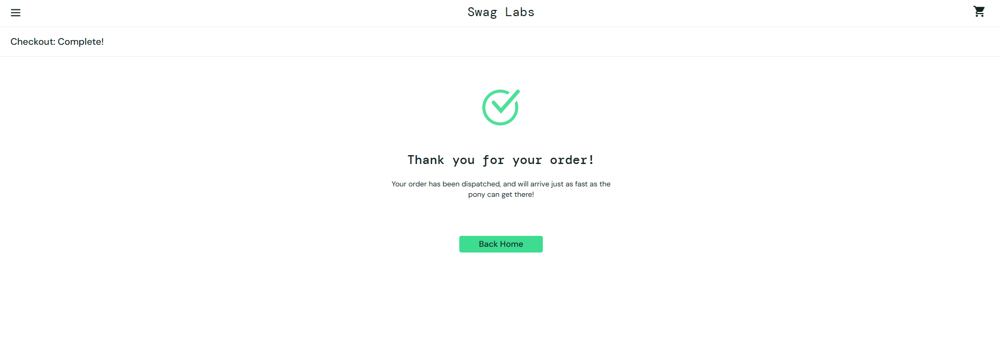

# TC-009 – Complete Checkout

## Objective

Verify that a user can complete the checkout process with valid information.

## Preconditions

- User is logged in.
- User has at least one product in the cart.
- User is on the Checkout Information page.

## Test Data

- Username: standard_user
- Password: secret_sauce
- Product: Sauce Labs Backpack
- First Name: Diego
- Last Name: Yano
- Postal Code: V5H 0A1

## Test Steps

1. Log in with valid credentials.
2. Add the Sauce Labs Backpack to the cart.
3. Open the cart.
4. Click Checkout.
5. Enter a valid first name.
6. Enter a valid last name.
7. Enter a valid postal code.
8. Click Continue.
9. Review the Checkout Overview page.
10. Click Finish.

## Expected Result

The order should be completed successfully, and the user should see a confirmation message.

## Actual Result

The order was completed successfully, and a confirmation message was displayed.

## Status

Pass

## Notes

The checkout flow worked as expected from cart to order confirmation.

## Evidence

